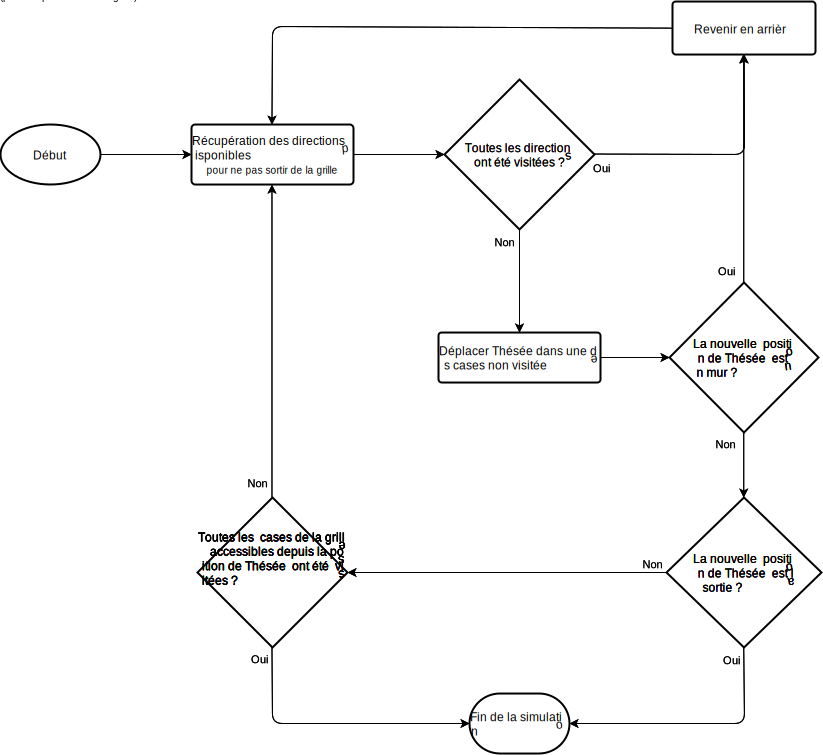

# L'algorithme d'Ariane
Cet algorithme d'Ariane a été développé dans le cadre de la 
[SAÉ2.01 "Développement d’une application"](http://www.iut-fbleau.fr/sitebp/pt21/21_2022/STCL6EZD72IDTX73.php) 
lors de notre première année (2022) de BUT Informatique à l'IUT de Fontainebleau.

## Compilation
Utiliser la commande suivante pour compiler le programme :
```bash
make
```

## Lancement
### Méthode n°1 (recommandée) : Compiler et lancer le programme avec Make
Utiliser la commande suivante pour compiler (si ce n'est pas déjà fait) puis lancer le programme :
```bash
make run
```

### Méthode n°2 : Compiler puis lancer le programme
Une fois la [compilation du programme](#compilation) faite, exécuter le programme à l'aide
de la commande suivante :
```bash
java -cp out/ Main
```

# Documentation
La documentation du programme est généré à l'aide de JavaDoc. Elle est disponible dans le dossier `doc/`
et peut être consultée en ouvrant le fichier `index.html` dans un navigateur web.
Utilisez la commande suivante pour générer la documentation :
```bash
make doc
```

## Utilisation
### Import/export de fichier labyrinthe (`.lab`)
#### Importer un labyrinthe
##### Méthode n°1 : Depuis la page d'accueil
Cliquez sur le bouton "Importer une grille"

##### Méthode n°2 : Depuis la ligne de commande
Lors du [lancement du programme](#lancement), ajoutez le chemin vers le fichier `.lab` en argument.
> Exemple :
> ```bash
> make run chemin/vers/le/fichier.lab
> ```
> ou :
> ```bash
> java -cp out/ Main chemin/vers/le/fichier.lab
> ```

#### Exporter un labyrinthe 
Depuis la page d'édition du labyrinthe, cliquez sur le bouton "Exporter" pour exporter le labyrinthe vers un
fichier `.lab`.

### Générer un labyrinthe aléatoire
Le programme dispose d'un générateur de labyrinthe aléatoire.
> ℹ️ Le générateur fait en sorte que le labyrinthe soit toujours résolvable, c'est-à-dire qu'il contient
> l'emplacement de Thésée ainsi qu'une sortie, et qu'il est possible d'atteindre la sortie depuis la position
> de Thésée.
#### Méthode n°1 : Depuis la page d'accueil
1. Cliquez sur le bouton "Générer une grille"
2. Entrez les dimensions de la grille
3. Cliquez sur le bouton "Remplir aléatoirement"

#### Méthode n°2 : Depuis la page d'édition du labyrinthe
Cliquez sur le bouton "Aléatoire"

### Algorithmes
Le programme possède 2 algorithmes de résolution de labyrinthe décris ci-dessous. Reportez-vous à la section
[Simulations](#simulations) pour savoir comment les utiliser.
#### Algorithme de résolution aléatoire
L'algorithme choisit aléatoirement une des directions disponibles.
#### Algorithme de résolution déterministe
L'algorithme choisit la direction la plus proche de la sortie
##### Algorigramme


### Simulations
Pour utiliser les algorithmes de résolution, le programme dispose de 2 modes d'affichages.
Pour lancer une simulation, cliquez sur le bouton "Démarrer" depuis la page d'édition du labyrinthe, choisissez
l'[algorithme de résolution](#algorithmes) que vous souhaitez utiliser, puis choisissez l'un des deux
modes d'affichage disponibles.
#### Mode d'affichage manuel (pas à pas)
Dans ce mode, l'utilisateur doit cliquer sur le bouton "Suivant" (ou sur la flèche directionnelle droite) pour faire
avancer l'algorithme d'une étape.

#### Mode d'affichage automatique
Dans ce mode, l'algorithme effectue automatiquement 100 simulations et affiche à l'écran le nombre moyen
de mouvements nécessaires à la résolution du labyrinthe.
> ℹ️ Étant donné que les simulations peuvent être longues en fonction de la taille du labyrinthe et de la puissance
> de calcul disponible, le programme affiche à l'écran le numéro de la simulation en cours ainsi que
> le nombre de mouvements effectués par l'algorithme en temps réel. Cette information disparait de l'écran
> une fois les 100 simulations effectuées.

## Crédits
-   Code :
    - Amir Daouadi (@daouadi)
    - Lyanis Souidi (@souidi)